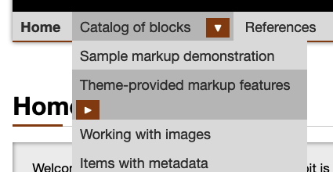
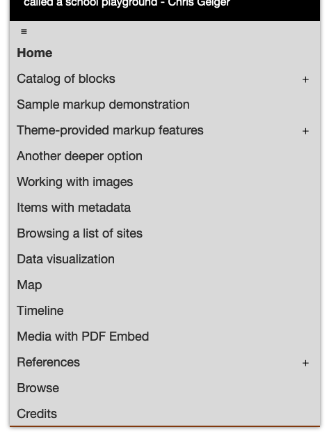
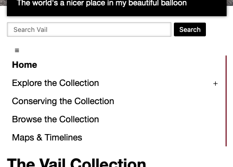
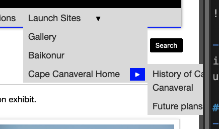

# Notes about the navigation system

Does this need an overview?

## Punch list

### Hamburger icon

- ~~Hamburger icon doesn't do anything for initial page load - menu initializes expanded.~~

- ~~Does hamburger need to be more prominent? With a border?~~

- ~~Hamburger on hover / focus should switch to white marks, not black.~~

### Toggle icons

- [ ] Can the `button` element take up the full space available? 

- [ ] Is the `button` element big enough on mobile screens? Should it be a carat instead?

### Compound list items

- [ ] Prevent the `button` element from wrapping below a menu item (see ["Theme-provided markup features"](https://mitlibraries-stage.omeka.net/s/theme-playground/page/home) at this link - compare to ["Explore the collection"](https://mitlibraries-stage.omeka.net/s/vail/page/home) link here)

- [ ] The menugroup shading (on the `li` element) is shown only for mouse interactions (the `:hover` pseudoselector). Can this be extended to keyboard users and other users?

- [ ] What contrast level is needed for the menugroup? Horizontal menus currently use much less contrast (because that menu has a light gray background, while vertical menus have a white background)

- [ ] Flash of competing styles when menugroup shading is applied - could this be scoped only to actually-compound elements?

- [ ] Can the carat be moved closer to the menu text? (CSS rules only to change)

### Interaction

- [ ] Menus currently stay open until closed, allowing multiple open menus (and deeper menus to remember that they are opened). Instead, menus should automatically close when not needed, showing in all cases only the most minimal set of visible elements.

- [ ] Need to explicitly set focus to the parent toggle when closing a menu via the escape key (i.e. focus on what you effectively just clicked on)

- [ ] Menu offsets should be re-calculated as windows re-size?

- [ ] Menus should collapse when focus leaves the menu element

### Layouts

- [ ] Mobile rendering does not indicate what elements are in a sub-menu, so hierarchy awareness is mostly impossible.

- ~~Styling is not consistent for mobile displays of horizontal and vertical menus (compare below image with one above) **Use the horizontal styling (shaded background, bottom border, maybe with box shadow)**~~

- ~~Need conditional logic to open a submenu toward the center of the screen (not always to the right)~~

- [ ] Do we worry about spacing between menu elements that is never shaded? (whitespace bewtween `li` elements)

- [ ] Do we worry about _very_ long menus (see [the list of students in the South Asia exhibit](https://digital-exhibits.libraries.mit.edu/s/south-asia-and-mit/page/students)) being taller than the screen height?

- [ ] Mobile layout of vertically-oriented menus should come before the search bar, not after.

- [ ] Re-check font sizes between browsers on horizontal menu, and look for gaps above/below.

---

Raw notes

...
